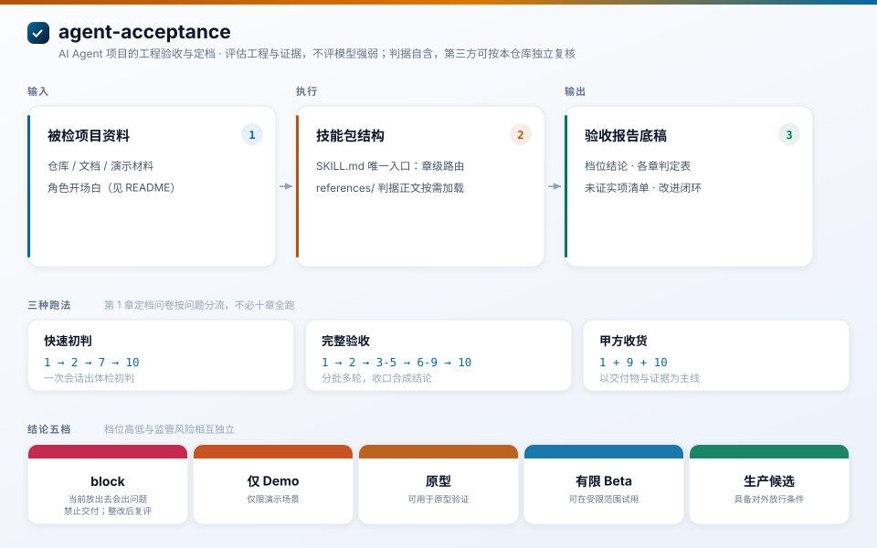

# agent-acceptance：AI Agent 项目的工程验收与定档

`agent-acceptance` 是一份面向 AI Agent 与多 Agent 项目的工程验收标准，以 Agent Skills 技能包形式发布。它回答三个问题：项目**是否拿得出手、能否放得出去、应给予什么档位**。

本标准的评估对象是工程与证据，而非模型能力。全部判据自含于技能包内，任何第三方均可依据本仓库独立复核并得到相同结论。它不评价模型能力强弱，不代替第三方资质检测或带章检测报告。

## 技能信息

- 技能名称：`agent-acceptance`
- 仓库地址：https://github.com/LPK3215/agent-acceptance
- 标准正文：`references/` 目录，共一个全局地图、十个章节与一个附录
- 执行方式：`SKILL.md` 定义技能触发与流程路由，加载后由 AI 助手按流程执行
- 安装方式：将本仓库内容放入支持 Agent Skills 规范的 AI 助手的技能目录即可加载，CodeBuddy 对应路径为用户目录下的 `.codebuddy/skills/agent-acceptance/`，放入后重启或重载技能索引

## 档位体系

验收结论分为五档：

- `block`：当前放出去会出问题，禁止交付。整改后可复评、可升档
- `仅 Demo`：仅限演示场景
- `原型`：可用于原型验证
- `有限 Beta`：可在受限范围试用
- `生产候选`：具备对外放行条件

档位高低与监管风险相互独立。涉及资金、隐私、人身安全等敏感面的项目，无论档位结论如何，均须另行通过安全底线与证据等级的把关。

## 文档结构

正文按编号组织，章节标题即对应评估面，入口为全局地图：

- [00 全局地图](references/00-全局地图.md)
- [01 范围、形态与档位](references/01-范围、形态与档位.md)
- [02 系统组成与真实接线](references/02-系统组成与真实接线.md)
- [03 考卷与评测集](references/03-考卷与评测集.md)
- [04 判分规则](references/04-判分规则.md)
- [05 指标与目标值](references/05-指标与目标值.md)
- [06 运行可观测](references/06-运行可观测.md)
- [07 安全与权限底线](references/07-安全与权限底线.md)
- [08 生产就绪与上线](references/08-生产就绪与上线.md)
- [09 交付物与证据链](references/09-交付物与证据链.md)
- [10 验收结论与档位](references/10-验收结论与档位.md)
- [附录A 元规则](references/附录A-元规则.md)

### 不是每次都全跑

上述十章是完整的能力清单，但实际验收不会十章全上。第 1 章“定档问卷”就是分流器：它通过 5 个问题确定被检项目的形态、技术栈、已有材料与自主度，然后据此决定后续哪些章实际开查、哪些直接跳过。

| 你的情况 | 实际跑哪些章 | 说明 |
|---|---|---|
| 自研项目，只有源码和文档 | 1 -> 2 -> 7 -> 10 | 一次会话出“体检初判”，3-5、6、8、9 记“未评估”并自动封顶 |
| 上线前或第三方交付，要完整验收 | 1 -> 2 -> 3-5 -> 6-9 -> 10 | 分批跑，每章一次会话，收口合成结论 |
| 甲方收货，只关心能不能签 | 1 + 9 + 10 | 以交付物与证据为主线，深查按需追加 |

缺材料的章不会拖垮结论，只记“未评估”并在报告中写明缺什么、补哪些可以升档。技能是“体检单”不是“考试”，不需要全跑才能出结果。

## 不同用户，不同用法

技能加载后，将对应开场白复制给 AI 助手即可开始。开场白包含技能名称与仓库地址，可确保调用准确。完整执行说明见 [SKILL.md](SKILL.md)。

### 甲方 / 业务验收方

适用场景：确认交付物是否值得接收、应以什么档位接收。

> 请使用 agent-acceptance 技能对项目做完整工程验收，技能来源仓库为 https://github.com/LPK3215/agent-acceptance。项目资料包括仓库、文档与演示材料，我会一并提供。请输出档位结论、各章判定表与未证实项清单；关键结论逐条附证据，无证据的判定标记为未证实。

结果：档位结论、各章判定表、未证实项清单，以及一份可供第三方复核复现的报告底稿。判据细节可读 [10 验收结论与档位](references/10-验收结论与档位.md) 与 [附录A 元规则](references/附录A-元规则.md)。

### 交付团队 / 开发者

适用场景：上线前自查，明确剩余差距、整改顺序与证据要求。

> 请使用 agent-acceptance 技能，技能来源仓库为 https://github.com/LPK3215/agent-acceptance，对项目做上线前自检。先执行第 1 章定档问卷，再按第 2 至第 6 章逐层核对检查点；第 7 章安全底线必须全部达标；最后输出差距清单、整改优先级以及每项缺口的证据要求。

结果：可逐项核对的检查表，以及按缺口自动封顶档位的整改优先级。建议从 [01 范围、形态与档位](references/01-范围、形态与档位.md) 开始，定档问卷以问答形式进行，无需事先阅读正文。

### 将验收外包给 AI 助手

适用场景：希望直接获得档位结论与放行判断，可选择不同跑法。

> 请使用 agent-acceptance 技能，技能来源仓库为 https://github.com/LPK3215/agent-acceptance，对项目做一次验收体检。先给结论再补过程，回答应给予什么档位以及当前能否放行。

三种跑法（与上表主线一致）：

- 快速初判：1 定档 -> 2 系统组成 -> 7 安全底线 -> 10 结论，单次会话给出结果
- 完整验收：1 -> 2 -> 3-5 -> 6-9 -> 10 顺章推，分批多轮，收口合成完整验收结论单
- 甲方收货：1 + 9 + 10 为主，以交付物与证据为主线，深查按需追加 3/7/8

结果：档位结论或放行判断，配套可复核的证据过程。AI 负责执行评估流程，关键结论应由人工复核证据后确认。

### 学习者 / 第三方复核人

适用场景：理解 Agent 项目的评估体系，用于撰写评审规范、授课或技术尽调。

> 请使用 agent-acceptance 技能，技能来源仓库为 https://github.com/LPK3215/agent-acceptance，以全局地图为纲，讲解 Agent 项目验收需要覆盖的评估面，重点说明档位判定逻辑与安全底线，并结合真实案例说明。

结果：随问随答的讲解向导。可先从 [00 全局地图](references/00-全局地图.md) 开始通读正文，判据可与 GB/T 25000.51、OWASP Agentic AI Top 10、Agent Card 等外部框架对照。

## 评估流程与产出

- 起点：回答第 1 章定档问卷，说明项目形态、技术栈、目标边界、成功标准与自主度，用于确定档位期望
- 过程：逐章检查。章首声明该层需提供的最低材料；材料不足时该层记为未评估，不视为通过，结论相应封顶并注明缺口与补齐优先级
- 耗时：三种跑法对应不同时长，快速初判一次会话完成，分批全量可分多轮执行
- 产出：验收报告底稿，包含档位结论、各章判定表、未证实项清单、安全红线与例外记录、改进闭环，可供第三方复核复现

## 使用边界

1. `block` 表示当前禁止放行，触发安全红线或证据不足以证明可信时给出，整改后复评可升档
2. 未评估不等于通过，任何未执行的面都会使结论封顶，缺口在报告中明示
3. 证据有等级，可复跑且可检查的证据优先于文档声称；对外场景中带章检测报告权重最高；无证据的结论一律记为未证实，不计入通过
4. 场景决定证据口径，内部自查不必配齐第三方口径；对外交付、合同引用与强合规场景须补齐证据等级，必要时由具备 CMA/CNAS 资质的机构出具报告
5. AI 负责执行评估流程，重大结论建议由人或第三方抽查证据链后再确认

## 质量标准

- 判据自含，不依赖本仓库之外的任何文件；对外引用均标注出处与版本，可按名检索复核
- 结构与语义双重复核：校验脚本自动检查正文结构、链接、字符纪律、章节命名一致性与判点引用完整性；语义规范见写作与引用规范
- 历次发布前机械检查零失败，仅余官方一手来源链接的提示项

## 参与维护与贡献

- 修改判据遵循写作与引用规范，章号与判点号是稳定主键，修改判据不得改动编号；新增检查面需先通过扩容三关，即通用、公用与可判
- 贡献指引、流程与行为约定见 [CONTRIBUTING.md](CONTRIBUTING.md)
- 机械自检：`python scripts/verify.py`
- 一键发布：`python scripts/release.py all`

## 许可证

本仓库以 [MIT License](LICENSE) 开源，作者与主要贡献者见 [AUTHORS](AUTHORS)，版本变更记录见 [CHANGELOG.md](CHANGELOG.md)。
