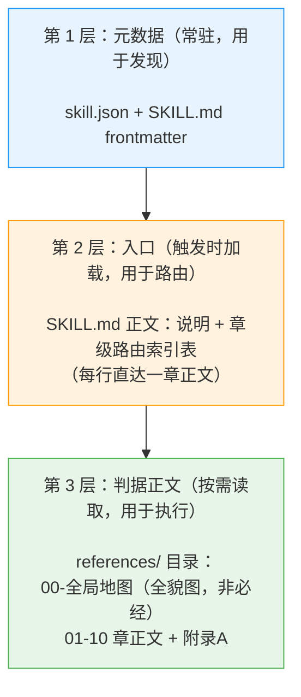
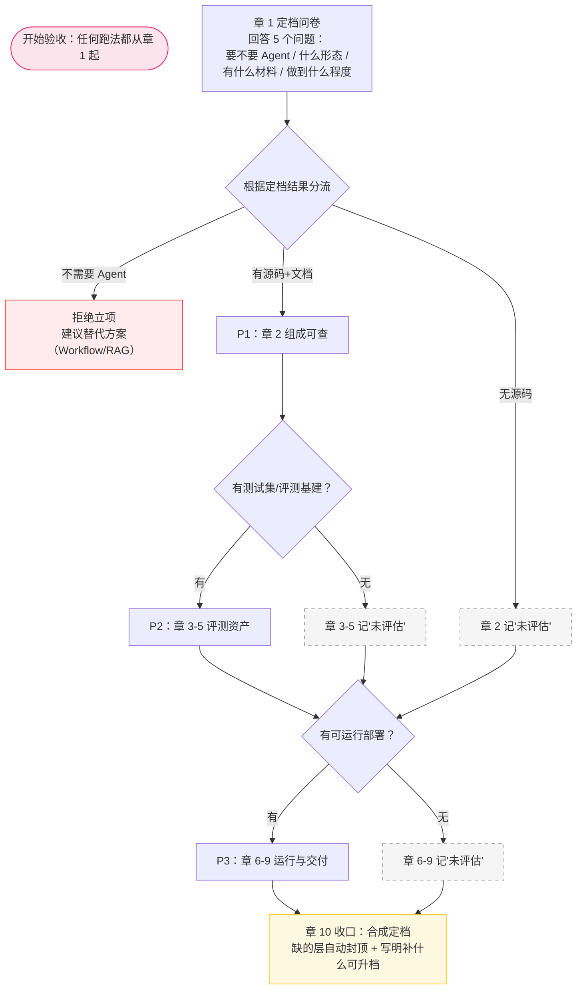
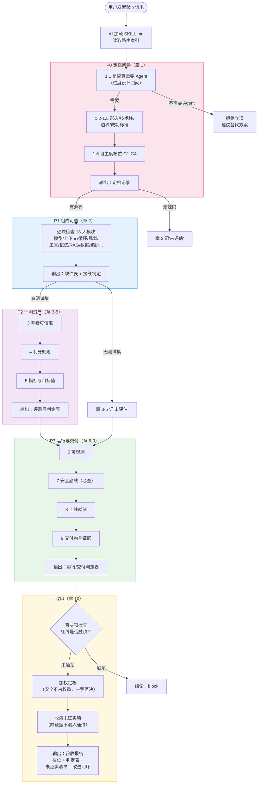
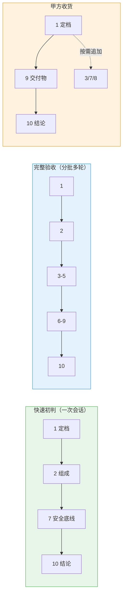
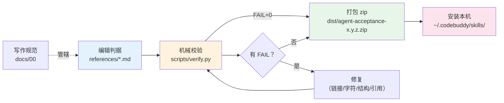
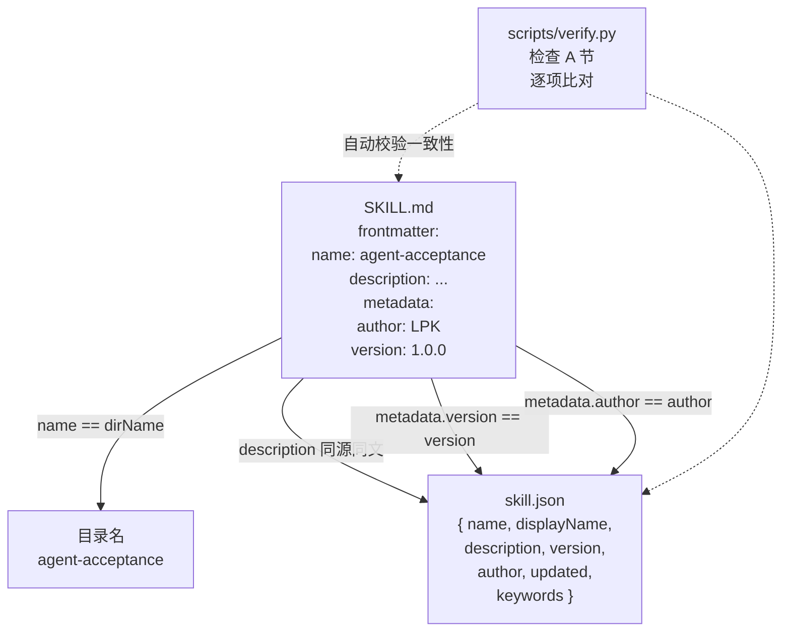

# 01 项目结构与流程图（作者维护文档）

> 本文件用图的方式回答三个问题：**这个包由什么组成**；**章 1 如何分流决定查哪些章**；**一次完整验收从头到尾怎么走**。
> 适合场景：新成员上手、回顾全貌、向他人讲解项目时直接截图使用。

---

## 1. 技能包文件结构（三层渐进式披露）

**核心规则**：
- 引用只有一层深：`SKILL.md` 直达 `references/` 各章，无第三层
- `00-全局地图.md` 与章正文平级，不是中间索引
- 打包单元 = `SKILL.md` + `skill.json` + `references/`；`docs/` 和 `scripts/` 不参与发布

---

## 2. 章 1 分流决策图（核心机制：不是每次都全跑）

**读图要点**：章 1 是必经入口，它的真正作用不只是“定档”，更是“分流”——决定后面哪些章上场、哪些跳过。缺材料的章不是失败，是“未评估”，结论会因此封顶但不会卡死。

---

## 3. 完整验收的章节流程（全跑场景）

---

## 4. 三种跑法的章覆盖范围

---

## 5. 开发与发布流水线（维护者视角）

**命令速查**：
| 做什么 | 命令 |
|---|---|
| 仅校验 | `python scripts/verify.py` |
| 一键发布 | `python scripts/release.py all` |
| 仅打 zip | `python scripts/release.py package` |
| 仅装本机 | `python scripts/release.py install` |
| 双击执行 | `scripts\verify.cmd` / `scripts\release.cmd` |

---

## 6. 元数据双写同步关系

