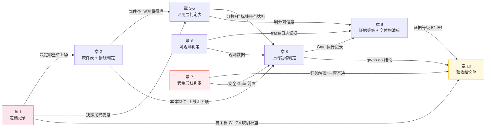

# 02 章间依赖与数据流（作者维护文档）

> 本文件回答：**各章之间有什么数据关系、谁是生产者谁是消费者、改一章会牵动谁。**
> 与 `01-项目结构与流程图.md` 互补：01 讲"整体长什么样、请求怎么走"，本文件聚焦"章与章的接线"。

---

## 1. 全局数据流（谁产出什么、谁拿去做什么）



---

## 2. 每章的输入与输出

| 章 | 输入（消费谁的产出） | 输出（产出什么给谁） | 关键产出字段 |
|---|---|---|---|
| 1 | 被检方口答/文档 | 定档记录（给 2-10） | 形态、技术栈、自主度 G1-G4、边界、成功标准 |
| 2 | 定档记录 + 源码/文档 | 缺件表、接线判定（给 3-5、8、10） | 13 模块的"有/缺/假接线"状态 |
| 3 | 定档记录 + 测试集 | 考卷可信度判定（给 4、5、9、10） | 自评基建、污染检测、覆盖度 |
| 4 | 章 3 产出 + 判分基建 | 判分规则判定（给 5、9、10） | judge 类型与校准状态、rubric 结构 |
| 5 | 章 3+4 产出 + 目标值 | 指标达标判定（给 8、9、10） | 各 SLI-SLO 的达标/不达标 |
| 6 | 可运行环境 | 可观测判定（给 8、9、10） | trace 覆盖度、审计字段完整度 |
| 7 | 源码 + 权限配置 | 安全底线判定（给 8、10） | **红线触顶清单**（一票否决源） |
| 8 | 章 2+5+6+7 全部产出 | 上线就绪判定（给 9、10） | Gate 执行记录、go/no-go 映射 |
| 9 | 各章证据 + 交付物 | 证据等级 + 交付物清单（给 10） | E1-E4 定级、Agent Card 分档 |
| 10 | 全部章的判定表 | 验收结论单（最终产出） | 档位、未证实项清单、改进闭环 |

---

## 3. 强依赖关系（上游未产出则下游无法执行）

| 下游章 | 强依赖上游 | 如果上游缺失 |
|---|---|---|
| 章 3-5 | 章 2（本体齐才谈得上评测） | 可独立跑，但覆盖判定会不完整 |
| 章 7 | 章 1（自主度档位决定安全加码强度） | 仍跑底线件，但 G3-G4 加码项可能遗漏 |
| 章 8 | 章 7（安全红线是 Gate 前置） | 7 未跑完不能判"能不能放出去" |
| 章 8 | 章 5（SLO 阈值是门禁依据） | 5 未设线 = Gate 缺判据，记"未评估" |
| 章 9 | 章 6（证据需要 trace 支撑） | 只有文档声称，证据等级降为 E3 |
| 章 10 | 全部可达层 | 缺的层封顶，结论明确标注"因 X 层未评估，最高 Y 档" |

---

## 4. 跨章引用热点（最常被其他章引用的判点）

| 被引用判点 | 出处 | 被谁引用 | 引用语义 |
|---|---|---|---|
| 7.5 红线清单 | 章 7 | 8.2、10.1.2 | Gate 前置 / 一票否决 |
| 7.1.1 权限上界 | 章 7 | 2.5、8.2、9.3 | "模型动作超权限"即阻断 |
| 1 定档记录 | 章 1 | 全部章 | 决定本层是否上场、加码强度 |
| 5.4 SLI-SLO | 章 5 | 8.2、10.1.3 | 门禁线与权重依据 |
| 9.2 证据等级 E 级 | 章 9 | 10.2 | "未证实"判定标准 |
| 9.3 Agent Card 分档 | 章 9 | 10.1.4 | 出口档位命名与四档映射 |
| 附录 A.2 反模式 | 附录 A | 3、4、10 | 自查清单联动 |

---

## 5. 独立性与可并行

并非所有章都是串行——以下章组可**并行独立执行**（只要各自的前置输入就绪）：

```
可并行组 A: 章 3 + 章 4 + 章 5（同属 P2，互不阻塞，章 10 汇总即可）
可并行组 B: 章 6 + 章 7（同属 P3 但互不依赖，章 8 同时消费两者）
可并行组 C: 章 2.1-2.13 各模块（章 2 内部 13 模块互不依赖）
```

**必须串行的关键链**：`章 1 -> (分流决策) -> 章 7 -> 章 8 -> 章 9 -> 章 10`
原因：安全红线是上线 Gate 的前置，上线记录是证据链的输入，各层结论是定档收口的依据。

---

## 6. 改动影响面速查（改哪章最危险）

| 如果修改了... | 需要联动检查... | 原因 |
|---|---|---|
| 章 1 的定档输出字段 | 全部章的"被检方提供物"门槛 | 章 1 是所有路由的源头 |
| 章 7 的红线判点（增/删/改编号） | 章 8.2 Gate、章 10.1.2 否决、章 9.3 分档 | 红线被三处硬消费 |
| 章 9.2 证据等级定义 | 章 10.2 未证实项判定 | 10 直接用 9 的 E 级做封顶逻辑 |
| 任何章的判点编号 | 全部跨章引用该编号的正文 | 判点号是稳定主键，改了引用就悬空 |
| 新增/删除一章 | SKILL.md 路由表、00-global-map、verify.py KNOWN_REF_FILES | 三处登记不同步会 FAIL |
